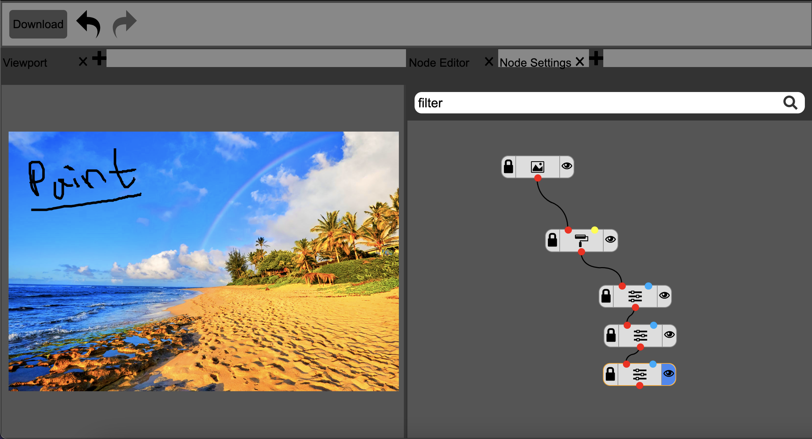

# Image Editor
This is a web app for editing images.



Instructions
===
Use the search bar in the node editor tab to find and create
new nodes. Once created and selected, the behavior of the node can be changed
through the node settings tab.
These nodes can be linked to other nodes by clicking
on an output connection of one (a colored dot) and the input
connection of another node. Clicking the eye icon means the state of a
node is visible and will be displayed on the canvas in the viewport tab.
The image node can be used to upload an image to the application. This state
can then be modified by applying other nodes on top of the image node.
Finally, to save the currently visible image in the viewport, click
the download button in the top left of the app.

Other Nodes:

transform - can be used to shift, scale, and rotate.

paint - can be used to draw on the image with the mouse.

filter - basic saturation filter.

merge - can combine two images into one.

Build
===
Run below to to build the extension. NPM must be installed.

```
npm i
```

```
npm serve
```
